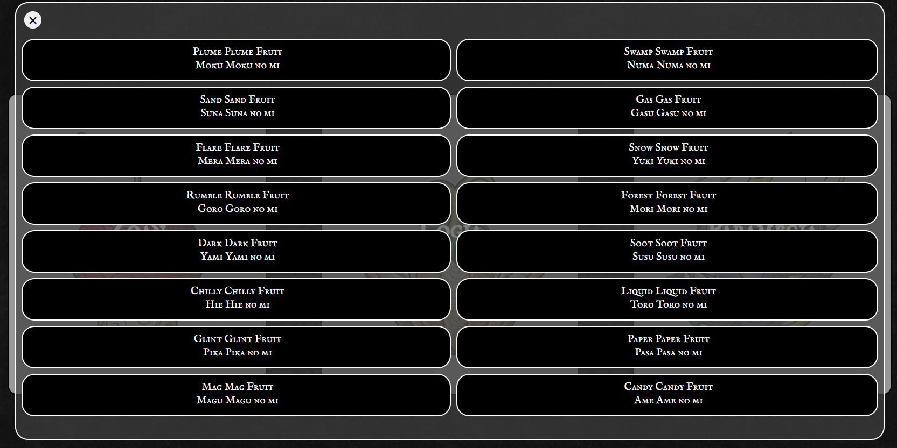

# Devil Fruit Encyclopedia

Welcome to the Devil Fruit Encyclopedia, your ultimate guide to all known Devil Fruits in the One Piece universe.

## Features

- **Search and Explore:** Effortlessly search through our extensive database of Devil Fruits to discover their names, Japanese names, and abilities.
- **User-Friendly Interface:** Enjoy a clean and intuitive user interface, making it easy to navigate and find the information you seek.
- **Dynamic Filtering:** Use the search bar to filter Devil Fruits dynamically, helping you find specific fruits or related information quickly.
- **Detailed Profiles:** Dive into detailed profiles for each Devil Fruit, including their abilities, users, and any additional relevant information.
- **Interactive Buttons:** Experience interactive buttons that allow you to seamlessly navigate between different Devil Fruits, enhancing the overall user experience.
- **Responsive Design:** Access the Devil Fruit Encyclopedia from various devices, ensuring a smooth and consistent experience across desktops, tablets, and mobile phones.

## How to Use

1. **Search Bar:**
   - Utilize the search bar to look for specific Devil Fruits. Just type the name or keyword, and the results will dynamically update.

   

2. **Info Buttons:**
   - Hover over the image of the fruit to get detailed information on the type of fruit it is.

   

3. **Filter Buttons:**
   - Click on the type of fruit you would like to see (Zoan, Logia, Paramecia) Once clicked it will give you a list of all the fruits that fall under that category.

   

   -Zoan and Paramecia both have 4 subcategories to choose from

   

4. **Explore Profiles:**
   - Click on the buttons displaying Devil Fruit names to explore detailed profiles. Each button corresponds to a specific Devil Fruit.
     
   

## Contribute

Feel free to contribute to the repository by adding new Devil Fruits, updating existing information, or improving the overall functionality of the website. Your contributions help make this encyclopedia a valuable resource for One Piece enthusiasts.

### How to Contribute

1. Fork the repository.
2. Create a new branch for your feature: `git checkout -b feature-name`
3. Commit your changes: `git commit -m 'Add feature-name'`
4. Push to the branch: `git push origin feature-name`
5. Submit a pull request.

## Explore

Explore the fascinating world of Devil Fruits and their intriguing powers with the Devil Fruit Encyclopedia. Happy browsing!
